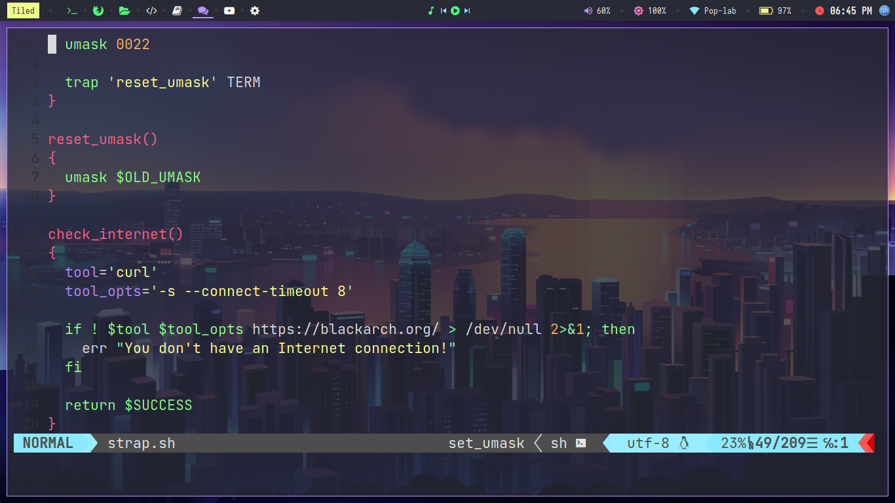
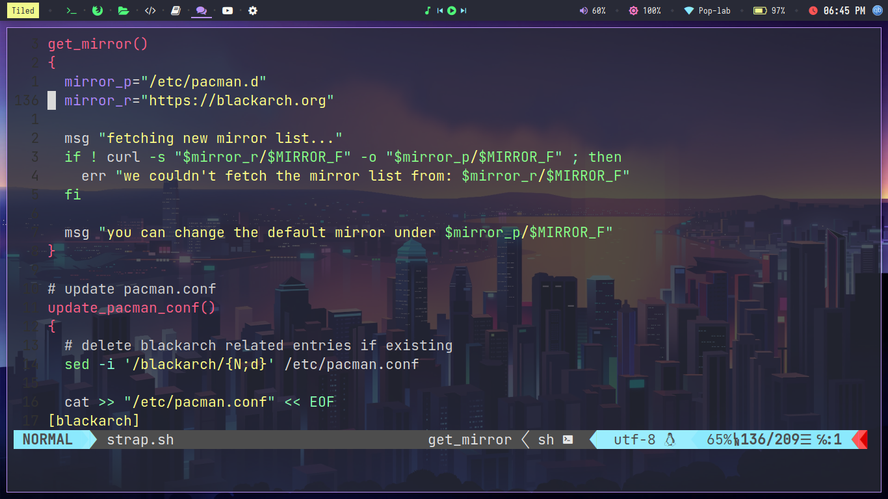

# nvim-config

# demo and how it will look afer configuration 






# Installing in linux nvim

# Arch

```
sudo pacman -S neovim
```
# Debian  

```
sudo apt-get install neovim
```
# Fedora
```
sudo dnf install -y neovim python3-neovim
```
# Flatpak
```
flatpak install flathub io.neovim.nvim
```
```
flatpak run io.neovim.nvim 
```
# For more go to this link below 

```
https://github.com/neovim/neovim/wiki/Installing-Neovim
```
# Open Terminal 


# FOLLOW THIS STEPS


# STEP-1
```
cd ~/.config
```
# STEP-2
```
mkdir nvim
```
# STEP-3
```
cd nvim
```
# STEP-6 if you don't have git than install it 
```
git clone https://github.com/Dhrubo111/nvim-config.git
```
# STEP-7
```
cp ~/.config/nvim/nvim-config/init.vim ~/.config/nvim/init.vim
```
# FINALLY WATCH THIS VIDEO AND FIX THE MISSING PLUGS AND ERROS 
```
https://www.youtube.com/watch?v=JWReY93Vl6g
```


# some things might be hard but after your fully configure it you will feel much batter


# THANK YOU ENJOY YOUR Neovim
